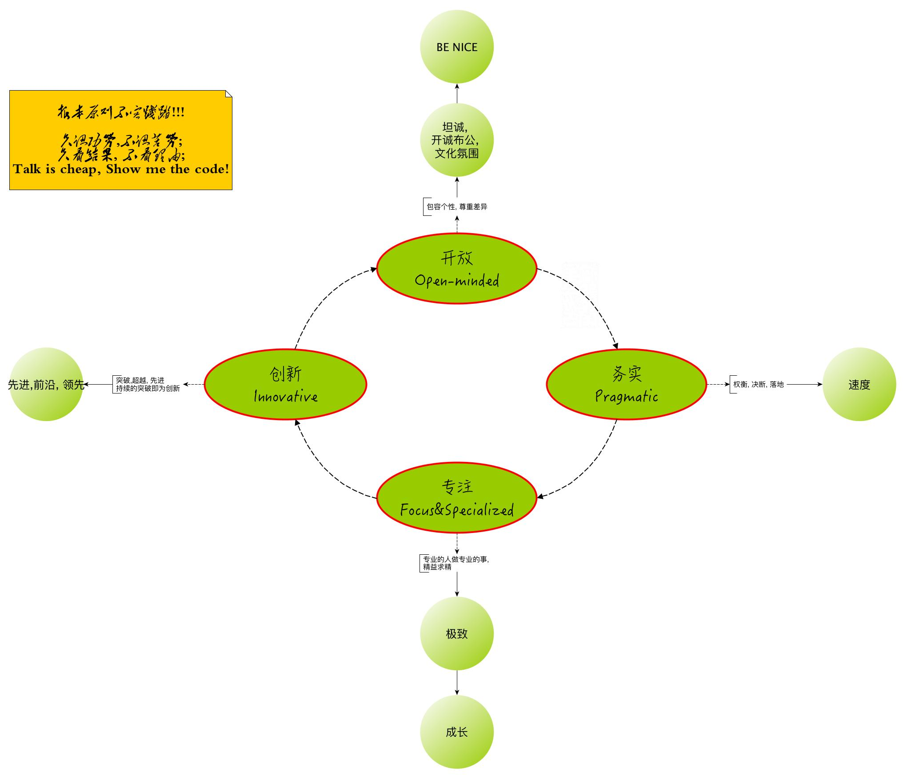

% Why I Chose Scala 
% 王福强
% 2021-10-10

I have been writing Scala code for many years, since sbt 0.11.x days.  

I checked [a project](https://github.com/fujohnwang/hs2client) that I open sourced many years ago when I was working at Alibaba, it tells me that it was 11 years ago. 

What time flies...

In fact, I had tried many programming languages, so choosing Scala as the main programming language brings a lot thoughts and practices.

# Pragmatic

I set up a big picture for a team that I think I would like to build and work in many years ago:

One of the factor is **Pragmatic**, people who can get things done quickly and efficiently in a simple way always rock me. 

When I chose Scala, **Pragmatic** is also an important factor. In those days, static program language with type omit and derivation helps a lot(we are lazy, right?). Semi-colons are annoying too. They are tiny things, but make me feel good, and don't want turn back to Java.

Another beautiful thing is, I can feel scala is designed with consistent philosophy inside. **Complexity at first sight, but Simpliciy inside**. 

So I settled.

# Personal Taste

If miscellaneous programming languages are different dish, Scala tastes so good for me.

Althought I find it has only a small community, but I still love to stick with it, at least it is good enough for me. 

When I write scala codes, usually I am buidling some products to meet some customers' need, so scala as a programming lang is just a tool not my end, as long as it helps me get things done quickly and efficiently, I will keep sticking with it. 

So I settled.

# Adapt for flexibility

Scala is not perfect, So I adapted it a lot.

Scala has a great community and wonderful ecosystem, but I don't connect and involve too much.

I use Scala as a better Java, that's my main principle, I called Scaja.

So I don't use ZIO, shapeless, blablabla... event SBT (I had tried maven, gradle, sbt many times, but settle on maven.)

Nothing blocks me to get jobs done, I only chose **Simple and Easy to Understand** tools. As long as remembering that it's NOT the end but tools and means.

I have adapted scala a lot when using it in real scenarios, I am happy with it.

So I settled.

